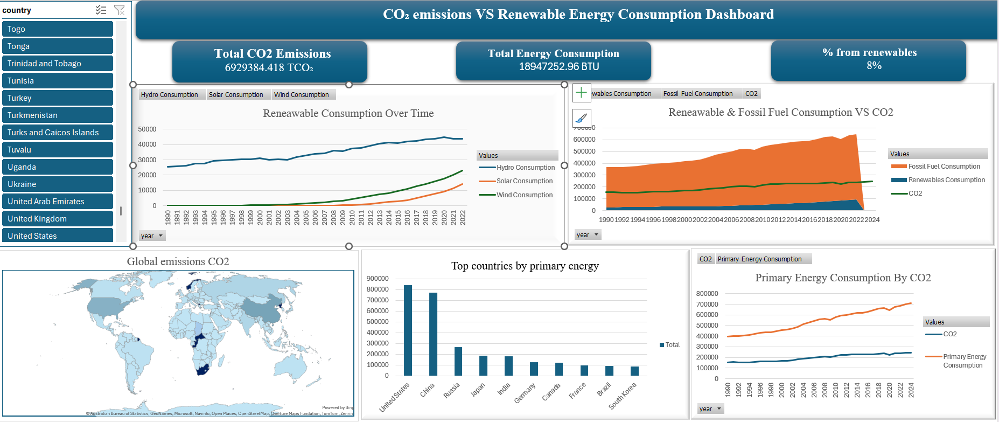

# 🌍 CO₂ Emissions vs Renewable Energy Consumption Dashboard

#### Tool: excel
#### Data Source: Owid-CO2-data.csv &word energy consumption.csv dataset
#### Objective: The goal is to make global energy insights accessible, visual, and dynamic.

  
# Project Overview 
This repository contains an interactive Global Energy & CO₂ Dashboard designed to explore long‑term trends in energy consumption, emissions, and renewable energy adoption across countries and years.
The dashboard provides a clean, modern interface for analyzing:
Total energy consumption
CO₂ emissions
Renewable energy share
Energy mix (fossil vs renewables)
Per‑capita metrics
Geographic CO₂ distribution
Growth of solar, wind, and hydro

 # Tools & Technologies
This project was built entirely using Microsoft Excel, leveraging advanced features:
## ✔ Power Query
•	Automated data import
•	Cleaning and transformation
•	Merging multiple datasets
•	Normalizing country names and time series
## ✔ Data Modeling
•	Fact & dimension tables
•	Relationships between tables
•	Star schema for efficient analysis

# Dashboard Features
### 🔹 KPI Cards
•	Total CO₂ Emissions
•	Total Energy Consumption
•	Renewable Energy Share (%)
### 🔹 Visualizations
•	Energy vs CO₂ Over Time (line chart)
•	Energy Mix vs CO₂ (stacked area + line)
•	Global Energy Mix (pie chart)
•	Renewable Sources (solar, wind, hydro trends)
•	CO₂ Emissions Map (filled map)
### 🔹 Interactivity
•	Slicers for Country 
•	All charts update dynamically
Map and chart linked via GETPIVOTDATA tables

# Key Insights
Global CO₂ emissions remain high despite growth in renewables
Hydro power dominates renewable consumption historically, but solar and wind are rising
Fossil fuel consumption strongly correlates with CO₂ output
Top energy-consuming countries (e.g., US, China, India) drive global emissions
Some countries show renewable growth without proportional CO₂ reduction, revealing energy demand challenges

# Dashboard Preview

